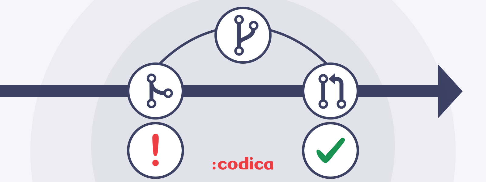

# Pull Request Best Practices



## Description

Code review is a very important part of the software development cycle. Pull requests are used to review code on branches before it reaches master. Code review is also one of the most difficult and time-consuming part of the software development process, often requiring experienced team members to spend time reading, thinking, evaluating, and responding to implementations of new features or systems.

Our [Codica](https://github.com/codica2) team has developed a set of rules and templates to be followed and this page roughly explains the steps that a pull request will go through.

## Pull Request Policy

### General

* Always create and use [Pull Request Templates](https://docs.gitlab.com/ee/user/project/description_templates.html#creating-merge-request-templates) for the repository you're working with.
* In the PR title use tags `[Fix]`, `[Feature]`, `[Refactor]`, `[Release]`, `[Hotfix]`
  
  Example:
  
  ```text
  [Fix] Sitemap bug solved.
  ```

* PR description must necessarily include:
  * Trello/Jira ticket URL
  * PR explanation and what it does
  * At least 2 code reviewers
* Always set a checkbox `Remove source branch when merge request is accepted.`

### Automate Pull Request Validation

* Be sure to configure [DangerBot](https://danger.systems/ruby/) to check the validity of your PRs

  You must have at least:
  * Ticket link
  * Description
  * Reviewers

We'll explain how to set up [DangerBot](https://danger.systems/ruby/) and provide a settings example below on this page.

### One ticket = One Pull Request

* One PR must contain changes corresponding to only one ticket
* In case when several tickets depend on each other, it makes sense to combine them into one

### Code Requirements

* Be sure to cover your code with tests
* If your code affects the launch, testing or deployment of the application, be sure to update the `Readme.md`

## Pull Request Templates Setup

Create a new Markdown (.md) file inside the `.gitlab/merge_request_templates/ ` directory in your repository. Commit and push to your default branch.

It's pretty easy. You can get acquainted with our [Template example](.gitlab/merge_request_templates/Task.md) here and use in your repository. The template is fully consistent with our Pull Request requirements and we will continue to customize DangerBot according to these requirements.

## Danger Bot Setup

Danger runs during your CI process, and gives teams the chance to automate common code review chores.

This provides another logical step in your build, through this Danger can help lint your rote tasks in daily code review.

You can use Danger to codify your teams norms. Leaving humans to think about harder problems.

### Installation

Danger is Ruby gem that runs a `Dangerfile`. You set up a `Dangerfile` per-project. The `Dangerfile` contains a collection of home-grown rules specific to your project.

Danger should be installed via a Gemfile. Add gem `danger` to your Gemfile, then run bundle.

You can integrate Danger into your own project on any available CI service. She will run through the process with you if you run danger init after installation.

Here is simple example how to add rules to your `Dangerfile`:

```ruby
failure 'Please add trello ticket to MR', sticky: true unless gitlab.mr_body.include?('https://trello.com/c/')
```

More [Dangerfile](Dangerfile) settings for Gitlab.

DangerBot in action:


You can also visit [DangerBot official site](https://danger.systems/guides/getting_started.html) to get started with it.

## License

Copyright © 2015-2019 Codica. It is released under the [MIT License](https://opensource.org/licenses/MIT).

## About Codica

[](https://www.codica.com)

The names and logos for Codica are trademarks of Codica.

We love open source software! See [our other projects](https://github.com/codica2) or [hire us](https://www.codica.com/) to design, develop, and grow your product.